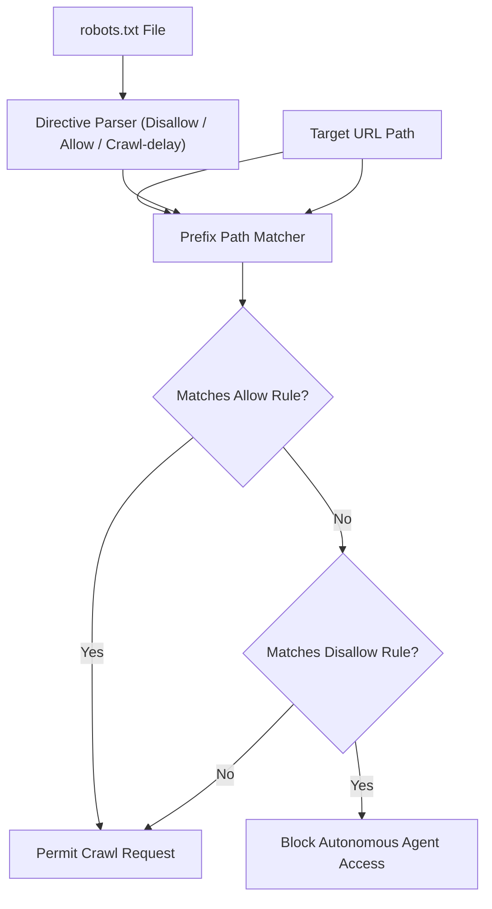

# genpark-robots-txt-crawl-delay-policy-evaluator-skill

Agent Skill implementing **RFC 9309 Robots.txt Permission & Rate Delay Evaluation** in 100% Python standard library.

## Architectural Flow

